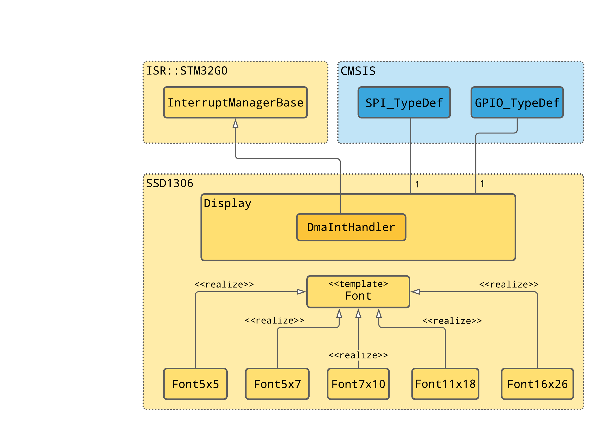

## SSD1306 Library

SSD1306 datasheet can be found [here](https://cdn-shop.adafruit.com/datasheets/SSD1306.pdf)

### Design



### Cmake

add_subdirectory(cpp_ssd1306)

### Usage

This uses DMA ISR with the stm32g0 specialization of the [isr_manager](https://github.com/cracked-machine/stm32_interrupt_managers).

```
#include <isr_manager_stm32g0.hpp>
#include <ssd1306.hpp>

// SPI peripheral for SSD1306 display driver serial communication
ssd1306::DriverSerialInterface<stm32::isr::InterruptTypeStm32g0> ssd1306_spi_interface(
    SPI1, 
    GPIOA, 
    LL_GPIO_PIN_0, 
    GPIOA, 
    LL_GPIO_PIN_3,
    stm32::isr::InterruptTypeStm32g0::dma1_ch2);

// @brief SSD1306 OLED driver
ssd1306::Driver<stm32::isr::InterruptTypeStm32g0> m_oled(
    ssd1306_spi_interface, 
    ssd1306::Driver<stm32::isr::InterruptTypeStm32g0>::SPIDMA::enabled
);

// init SSD1306 IC display driver
m_oled.power_on_sequence()

std::string text = "Say something clever";
m_oled.write(text, m_font, 0, 0, ssd1306::Colour::Black, ssd1306::Colour::White, 3, true);


{
 

```
